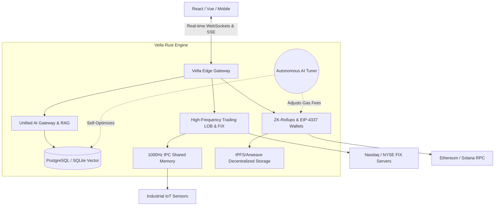

<div align="center">
  
  <h1>Vella Framework</h1>
  <p><strong>The Decentralized Operating System for the AI and Web3 Era.</strong></p>

  [](https://github.com/CharleGutierrez/Vella/actions)
  [](https://opensource.org/licenses/MIT)
  [](https://www.rust-lang.org/)
</div>

---

## ⚡ What is Vella?
**Vella is a God-Tier Decentralized Operating System.** 

It is not just a backend framework; it is an all-encompassing, self-optimizing technological superweapon written entirely in memory-safe Rust. It was engineered to replace dozens of fractured microservices by unifying the four most powerful frontiers of modern computer science into a single, cohesive engine:

### 1. The Autonomous Brain (Artificial Intelligence)
Vella doesn't just connect to AI; it is fundamentally controlled by it.
* **The AI Tuner:** Vella actively monitors its own heartbeat. If it detects a DDoS attack, server lag, or a flash crash in the stock market, the AI automatically rewrites its own SQL indexes, trips circuit breakers, and reallocates memory to keep the server alive without human intervention.
* **Native RAG:** It contains a built-in Vector Database that instantly chunks, embeds, and searches through millions of documents for semantic context.

### 2. The Global Economy (Web3 & Cryptography)
Vella is the ultimate framework for Decentralized Applications.
* **Absolute Privacy:** It uses **Fully Homomorphic Encryption (FHE)** to run complex AI neural networks on encrypted user data without ever actually decrypting it in memory.
* **Smart Contract Autonomy:** It can write, compile, and deploy its own Solidity Smart Contracts directly to Ethereum.
* **Zero-Knowledge Rollups:** It compresses thousands of transactions into a single cryptographic proof, saving 99% on blockchain gas fees.

### 3. The Financial Superweapon (High-Frequency Trading)
Vella contains the architecture of a Wall Street hedge fund out of the box.
* **The FIX Protocol:** It can bypass retail brokers and send stock orders directly to the Nasdaq and NYSE in microseconds.
* **FPGA Compilation:** You can write a trading algorithm in Vella, and it will physically compile that code into **Verilog (Hardware Description Language)**, allowing you to flash it onto physical silicon chips for zero-latency, speed-of-light trade execution.

### 4. The Physical World (SCADA & DePIN)
Vella bridges the gap between software and physical hardware.
* **1000Hz IPC Memory:** It can ingest telemetry from Formula 1 race cars or industrial power grids with nanosecond latency, bypassing slow databases entirely.
* **DePIN Integration:** Connect physical hardware (like a solar panel or weather sensor) to Vella, and it will automatically mint and distribute crypto tokens to reward the physical device.

**In Summary:**
If you want to build a simple to-do app, Vella can do it in seconds with its auto-generated TypeScript SDKs. But if you want to build a High-Frequency Trading firm, a global Artificial Intelligence network, or the next billion-dollar Web3 protocol, **Vella is the only framework on the planet capable of doing it all at once.**

---

## 💻 Developer Experience (DX) First

Vella is heavily inspired by Supabase and PocketBase, but engineered for the extreme edge.

### Agentic Schema Scaffolding
Just tell Vella what you want, and the built-in AI will architect your database schemas automatically.

```rust
use vella::prelude::*;

#[tokio::main]
async fn main() {
    let mut app = VellaApp::new();

    // The AI generates the entire User schema, Auth flow, and Vector fields
    let user_schema = AiScaffolder::generate("A Web3 User with an Embedded Wallet and FaceID");
    app.register(user_schema);

    // Start the ultra-fast Rust server
    app.serve().await;
}
```

### Zero-Config TypeScript Sync
Vella completely eradicates the need for GraphQL or tRPC. The moment you define a schema in Rust, Vella generates an exact, type-safe TypeScript SDK (`vella-sdk.ts`) and pushes it to your React/Vue frontend automatically.

```typescript
// Auto-generated by Vella!
import { VellaClient } from './vella-sdk';

const vella = new VellaClient();
const wallet = await vella.auth.provisionEmbeddedWallet("satoshi@vella.dev");
```

---

## 🏗️ Architecture



---

## 🛡️ Enterprise Security & Resilience
- **Order By Whitelist SQLi Defense:** Bulletproof against automated injection attacks.
- **DDoS Rate Limiting & Circuit Breakers:** If an external API goes down, Vella self-heals via exponential backoffs.
- **Expired Session Replay Prevention:** Blocks malicious actors from intercepting WebSocket payloads.

---

## 🏁 Get Started
Vella is ready for production. Clone the repo and boot the engine:

```bash
git clone https://github.com/CharleGutierrez/Vella.git
cd Vella
cargo build --release
cargo run
```

_Vella: Because building the future shouldn't require 50 different microservices._
