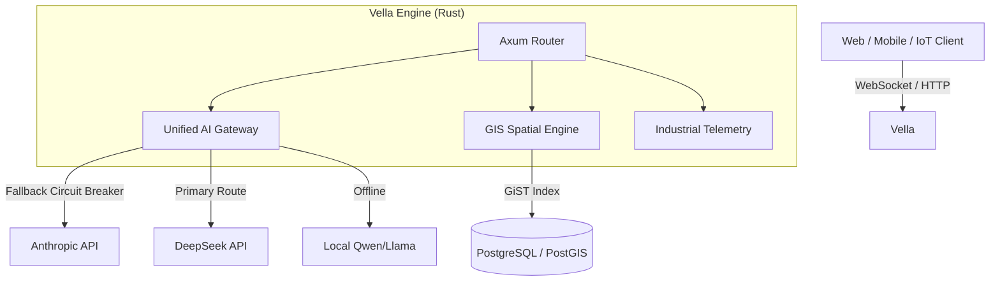

<div align="center">
  <h1>⚡ Vella</h1>
  <p><b>The Ultra-Fast, AI-Native Headless CMS written in Rust.</b></p>
</div>

<p align="center">
  <a href="https://github.com/CharleGutierrez/Vella/actions"></a>
  <a href="https://opensource.org/licenses/MIT"></a>
  <a href="https://www.rust-lang.org"></a>
</p>

Vella is not just another CMS. It is a highly concurrent, industrial-grade backend engine designed specifically for the AI era. Whether you are building a multimodal AI chat app, an enterprise GIS mapping tool, or an F1 telemetry dashboard, Vella has the internal architecture to handle it securely at the edge.

## 🚀 Killer Features

- **🧠 Unified AI Gateway:** Native integrations with OpenAI, Anthropic (Claude), Google (Gemini), DeepSeek, Grok, and local Ollama models. Supports Tool Calling, Multimodal Vision, JSON Structured Outputs, and Server-Sent Events (Streaming).
- **🛡️ AI Circuit Breakers (Failover):** Enterprise high-availability. If Anthropic goes down, Vella automatically catches the `HTTP 500` and falls back to Grok or a local Qwen model without dropping the user's request.
- **🌍 Native GIS & Spatial Support:** Built-in `Point`, `Polygon`, and `Geometry` field types with GiST indexing for lightning-fast spatial queries.
- **🏭 Industrial & Real-Time:** 1000Hz IPC shared-memory bridges, UDP telemetry listeners, and SCADA protocol drivers out-of-the-box.
- **⚡ WASM Edge Pipelines:** Compile Python data-science models to WebAssembly and run them directly in the database pipeline at edge speeds.

## 🛠️ The AI Gateway in Action

Vella abstracts away all the proprietary JSON formatting of different AI providers. 

```rust
use vella::ai::{UnifiedAiGateway, AiConfig, AiProvider, AiRequest, AiMessage};

let gateway = UnifiedAiGateway::new();

let claude = AiConfig {
    provider: AiProvider::Anthropic,
    base_url: "https://api.anthropic.com/v1/messages".to_string(),
    api_key: "sk-...".to_string(),
    model: "claude-3-5-sonnet-20240620".to_string(),
};

let grok = AiConfig {
    provider: AiProvider::Grok,
    base_url: "https://api.x.ai/v1/chat/completions".to_string(),
    api_key: "xoxb-...".to_string(),
    model: "grok-2-latest".to_string(),
};

// Automatic Failover: Tries Claude first, falls back to Grok on failure
let response = gateway.generate_with_fallback(&claude, &grok, "Explain quantum physics").await;
```

## 🏗️ Architecture 



## 📦 Getting Started

Ensure you have Rust and Cargo installed, then clone the repository:

```bash
git clone https://github.com/CharleGutierrez/Vella.git
cd Vella
cargo build
cargo test
```

## 🤝 Contributing

Pull requests are welcome! If you want to add a new AI Provider to the `UnifiedAiGateway` or add a new GIS field type, please ensure you write a test case for it and verify it passes via `cargo test`.
