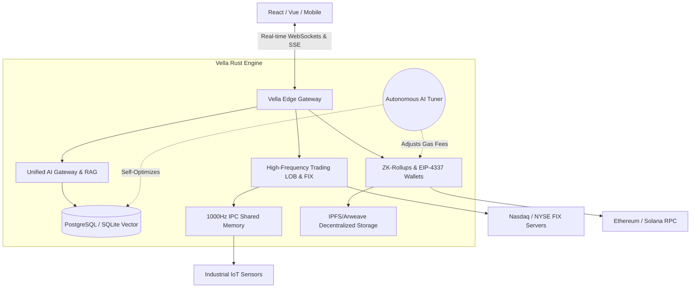

<div align="center">
  
  <h1>Vella Framework</h1>
  <p><strong>The Decentralized Operating System for the AI and Web3 Era.</strong></p>

  [](https://github.com/CharleGutierrez/Vella/actions)
  [](https://opensource.org/licenses/MIT)
  [](https://www.rust-lang.org/)
</div>

---

## ⚡ What is Vella?
Vella is not just a backend framework; it is a **Decentralized Operating System**. Written entirely in memory-safe, ultra-fast Rust, Vella unifies Relational Databases, AI Gateways, High-Frequency Trading (HFT), and Web3 Blockchain architecture into a single, cohesive engine.

If you are building the next billion-dollar FinTech startup, a massive Multiplayer Web3 Game, or a globally distributed AI agent network, Vella is the only infrastructure you will ever need.

---

## 🚀 God-Tier Features

### 🧠 Native AI & Retrieval-Augmented Generation (RAG)
Vella doesn't just connect to AI; it is fundamentally powered by it.
- **RAG Vector Database:** Native integration with `pgvector`. Vella automatically chunks documents, generates 1536D embeddings, and executes Cosine Similarity searches.
- **AI Decision Engine:** Vella can read text streams (like Bloomberg News) and calculate real-time Risk Assessments using local or remote LLMs.
- **Autonomous AI Tuner:** Vella actively monitors its own CPU load and database telemetry. If it detects network congestion, it automatically optimizes SQL indexes and adjusts cryptographic complexity on the fly to prevent crashes.

### ⛓️ Web3 & Blockchain Singularity
Vella is the ultimate Headless CMS for Decentralized Applications (dApps).
- **Smart Contract Compiler:** Vella can dynamically compile Solidity into EVM bytecode and auto-deploy it to Ethereum.
- **Zero-Knowledge Rollup Sequencer:** Vella batches thousands of high-speed off-chain database actions and rolls them up into a single cryptographic ZK Proof, saving 99% in Ethereum gas fees.
- **Fully Homomorphic Encryption (FHE):** Vella's AI can perform matrix multiplications on your users' data *without ever decrypting it*, preserving absolute Zero-Knowledge privacy.
- **EIP-4337 Account Abstraction:** Vella automatically spins up invisible, gas-less Smart Contract Wallets for your users the moment they sign in via Google.

### 📈 High-Frequency FinTech Trading (HFT)
Built to replace legacy Wall Street infrastructure.
- **Native FIX Protocol Engine:** Send stock and forex orders directly to the matching engines of Nasdaq or the NYSE in microseconds.
- **FPGA Hardware Compiler:** Write a trading strategy in Rust, and Vella will compile it directly into raw **Verilog HDL** so you can flash it onto physical silicon chips for zero-latency, speed-of-light execution.
- **Limit Order Book (LOB):** A native in-memory matching engine to build your own Binance or Robinhood exchange out of the box.

### 🏭 SCADA & DePIN (Decentralized Physical Infrastructure)
- **1000Hz IPC Shared Memory:** Ingest telemetry from F1 race cars or industrial IoT sensors with nanosecond latency.
- **DePIN Gateway:** Connect physical hardware (like solar panels) to Vella, and it will automatically mint and distribute crypto token rewards to the physical device's wallet address.

---

## 💻 Developer Experience (DX) First

Vella is heavily inspired by Supabase and PocketBase, but engineered for the extreme edge.

### Agentic Schema Scaffolding
Just tell Vella what you want, and the built-in AI will architect your database schemas automatically.

```rust
use vella::prelude::*;

#[tokio::main]
async fn main() {
    let mut app = VellaApp::new();

    // The AI generates the entire User schema, Auth flow, and Vector fields
    let user_schema = AiScaffolder::generate("A Web3 User with an Embedded Wallet and FaceID");
    app.register(user_schema);

    // Start the ultra-fast Rust server
    app.serve().await;
}
```

### Zero-Config TypeScript Sync
Vella completely eradicates the need for GraphQL or tRPC. The moment you define a schema in Rust, Vella generates an exact, type-safe TypeScript SDK (`vella-sdk.ts`) and pushes it to your React/Vue frontend automatically.

```typescript
// Auto-generated by Vella!
import { VellaClient } from './vella-sdk';

const vella = new VellaClient();
const wallet = await vella.auth.provisionEmbeddedWallet("satoshi@vella.dev");
```

---

## 🏗️ Architecture



---

## 🛡️ Enterprise Security & Resilience
- **Order By Whitelist SQLi Defense:** Bulletproof against automated injection attacks.
- **DDoS Rate Limiting & Circuit Breakers:** If an external API goes down, Vella self-heals via exponential backoffs.
- **Expired Session Replay Prevention:** Blocks malicious actors from intercepting WebSocket payloads.

---

## 🏁 Get Started
Vella is ready for production. Clone the repo and boot the engine:

```bash
git clone https://github.com/CharleGutierrez/Vella.git
cd Vella
cargo build --release
cargo run
```

_Vella: Because building the future shouldn't require 50 different microservices._
