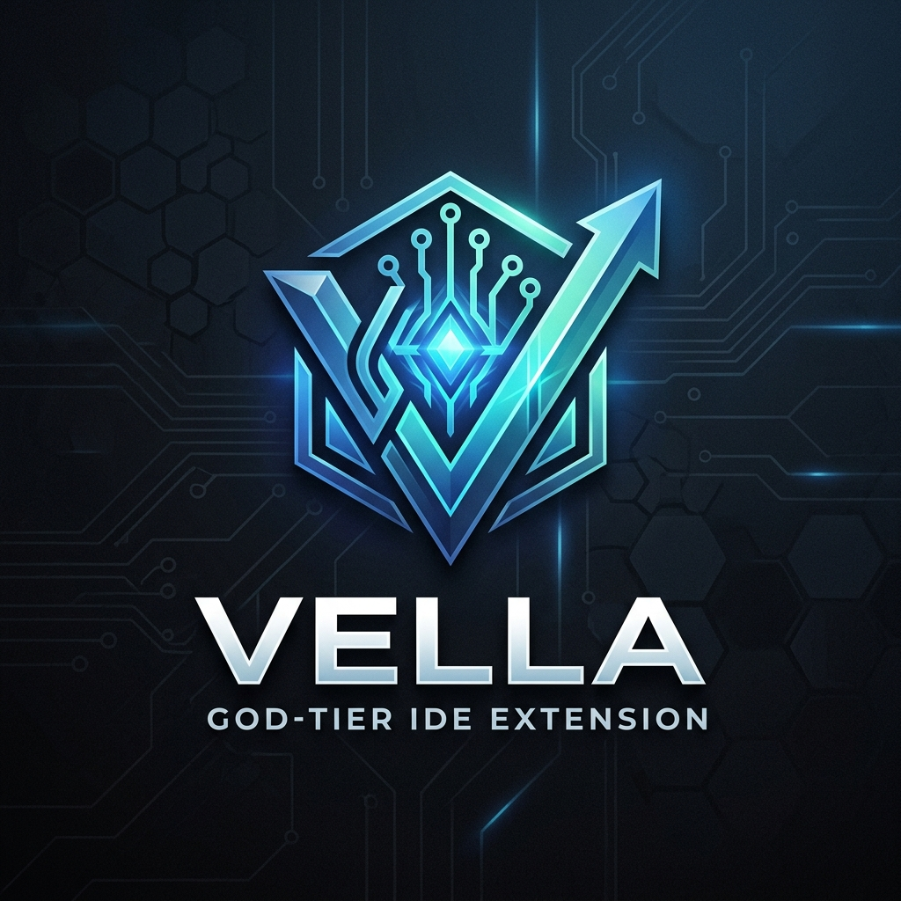

<div align="center">
  
  <br/>
  <h1>Vella VS Code Extension: The Ultimate Guide</h1>
</div>

Welcome to the Vella extension! This isn't just a code formatter—it is a "God-Tier" development toolkit built directly into VS Code. It bridges your IDE physically to your local database, your network layer, and powerful AI models.

---

## 🚀 Step 1: Installation
If you haven't installed it yet, it only takes one second.
1. Open your terminal in the root of the Vella repository.
2. Run the following command to install the packaged extension directly into your IDE:
   ```bash
   code --install-extension vscode-extension/vella-vscode-0.0.2.vsix
   ```
3. Restart VS Code (or press `F5` if you are running it in a development host).

---

## 🤖 Step 2: Configuring the AI Copilot
The Vella AI Copilot lives directly inside your editor and can write code, debug errors, and generate algorithms. Best of all, **it is completely model-agnostic.**

Open your VS Code Settings (Press `Ctrl + ,` or `Cmd + ,`), search for **"Vella"**, and configure your AI based on your preference:

### Option A: Using Google Gemini (Recommended)
1. **Vella: Ai Endpoint:** Paste `https://generativelanguage.googleapis.com/v1/models/gemini-1.5-pro:generateContent` *(Do not open this link in a browser, just paste it here!)*
2. **Vella: Ai Api Key:** Paste your Google AI Studio API Key.

### Option B: Using OpenAI (ChatGPT)
1. **Vella: Ai Endpoint:** Paste `https://api.openai.com/v1/chat/completions`
2. **Vella: Ai Model:** Type `gpt-4o` or `gpt-3.5-turbo`
3. **Vella: Ai Api Key:** Paste your OpenAI API Key.

### Option C: Using Local Ollama (Free & Offline)
1. **Vella: Ai Endpoint:** Paste `http://localhost:11434/v1/chat/completions`
2. **Vella: Ai Model:** Type your local model name (e.g., `llama3` or `mistral`).
3. **Vella: Ai Api Key:** *(Leave this completely blank)*.

**How to use it:** Open the Command Palette (`Ctrl+Shift+P`) and type `Vella: Open AI Copilot`.

---

## 🛠️ Step 3: Core Workflow Features
Once installed, open the VS Code Command Palette (`Ctrl+Shift+P` / `Cmd+Shift+P`) and type `Vella:` to see the massive list of tools. Here is how to use the most important ones:

### 1. The "Zero-Context-Switching" API Tester
*   **Command:** `Vella: Test Local API Endpoint`
*   **What it does:** Replaces Postman. It asks you for a route (e.g., `GET /api/users`), physically hits your local Vella server, measures the exact millisecond latency, and opens the beautifully formatted JSON response right next to your code.

### 2. Full-Stack Syncing (For React/Vue Developers)
*   **Command:** `Vella: Export TypeScript Interfaces`
    *   *What it does:* Scans your backend Rust code and instantly writes a `vella-types.d.ts` file so your Frontend has perfect Autocomplete matching your database.
*   **Command:** `Vella: Generate Frontend API Hooks`
    *   *What it does:* Automatically writes fully-typed React (`useSWR`) or Vue Composables wired to your Vella API endpoints.

### 3. Database Management (For Backend Engineers)
*   **The Vella Explorer:** Look at the left Activity Bar in VS Code. Click the Vella icon. It actively queries your local `vella.db` SQLite file, showing you a live tree of every table and column type in your database.
*   **Command:** `Vella: Seed Database with Mock Data`
    *   *What it does:* Instantly injects 5 rows of random, realistic mock data into your selected database table. 

### 4. Network Operations (For DevOps & Cloud)
*   **Command:** `Vella NetOps: Analyze Local Socket Bindings`
    *   *What it does:* If your server won't start because of an `Address already in use` error, run this. It executes `lsof`/`netstat` and tells you exactly which process is blocking your ports.
*   **Command:** `Vella Cloud: Scaffold Terraform / Kubernetes`
    *   *What it does:* Instantly writes production-grade AWS Terraform architecture or Kubernetes Deployment/HPA YAMLs into your workspace.

### 5. Web3 & Blockchain Tooling
*   **Command:** `Vella Web3: Inspect Live ETH Network State`
    *   *What it does:* Enter any Ethereum address, and it will execute a raw JSON-RPC call to Cloudflare's node to fetch the live Mainnet ETH balance.
*   **Command:** `Vella Web3: Generate TS Bindings from ABI`
    *   *What it does:* Finds compiled `.json` smart contracts in your workspace and auto-generates perfect TypeScript frontend bindings.

---

## 🔮 Step 4: The Visual "God-Tier" Tools
Vella includes several interactive, visually stunning UI tools built directly into VS Code:

*   **Vella: Open Visual Schema Builder:** Opens an interactive canvas. You can click and drag your database tables around. Click "Save Schema" to permanently write the layout back to your hard drive.
*   **Vella: Agent Swarm Orchestrator:** Opens an animated dashboard. Click "Dispatch Task", and watch as the extension physically writes a Rust file to your hard drive, runs `cargo check` in the background, and reports the compiler success/failure in real-time.
*   **Vella: Enter Spatial VR/AR Mode:** Renders a gorgeous, mouse-interactive 3D physics map of your software architecture.

**You are now a Vella Master.** Enjoy building highly optimized, full-stack software faster than ever before!